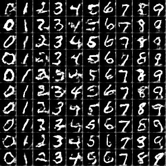
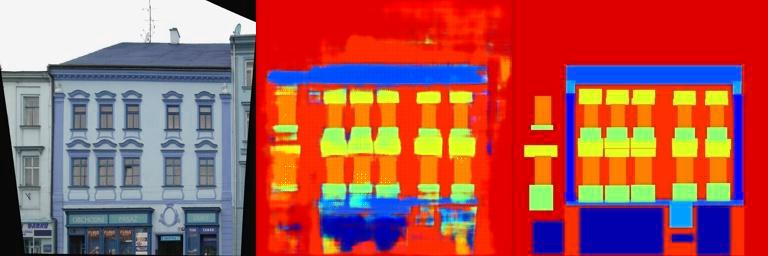
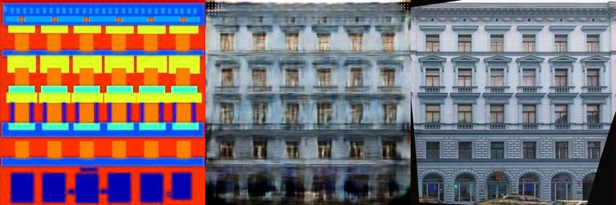

# [**Deep Convolutional GANs (DCGANs)**](notebooks/DCGAN_MNIST.ipynb)

Class sweep: With the same z slowly move the class labels to smoothly generate different numbers

Z-Space interpolaton: Vary a coefficient that determines how much of two different Z values are used to sample from the generator.

Essentially combination of two works:

### Generative Adversarial Nets
Ian J. Goodfellow et al 2014_Universite de Montreal
### Unsupervised Representation Learning with Deep Convolutional Generative Adversarial Networks
Radford et al 2016_indico Research and Facebook Research

In Adversarial training procedure two models are trained together. The generative model, G, that estimates the data distribution and the discriminative model, D, that determines if a given sample has come from the dataset or artificially generated. G is evolved into making artificially generated samples that are with higher probability mistaken by the D model as coming from true data distribution. One nice property of GANs is that the generator is not directly updated with data examples, but by the gradients coming through the discriminator. Here we will make a conditional generative model p(x|c) by adding some class label c as input to both G and D.
Previously Deep Convolutional GANs (Neural Networks) were not that easy to train. The second paper offers some guidelines which makes DCGANs easier to train.

Above we see the results after 200 epochs of training with Adam update rule and learning rate of 0.0002 and beta1 of 0.5 on MNIST dataset.
# [**Imge-to-Image translation with DCGANs**](notebooks/img2imgGAN.ipynb)
### Image-to-Image Translation with Conditional Adversarial Networks
Isola et al 2016_Berkeley AI Research (BAIR) Laboratory

#### Translation of CMP Images to Labels (A2B)

#### Translation of CMP Labels to Images (B2A)

